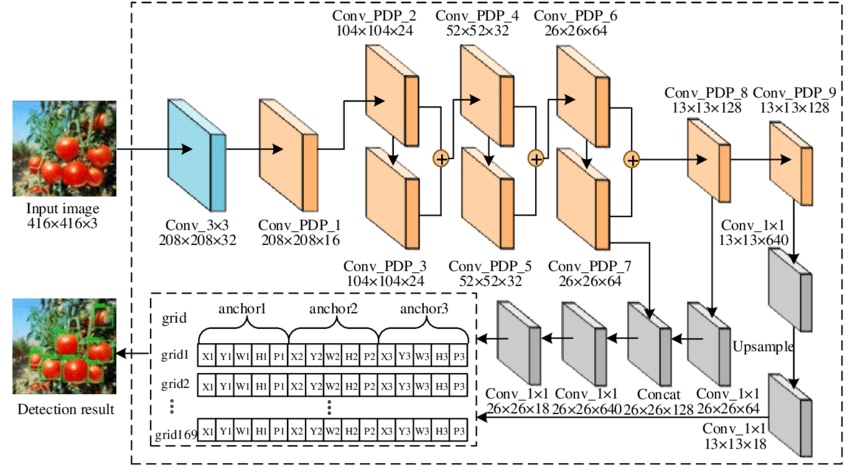

# Phase 1 : Lane_Line_Detection


## Dependencies:

    Python 3.5.x
    NumPy
    CV2
    matplotlib
    glob
    PIL
    moviepy

## How to run phase 1 ?

Open Anaconda cmd ,with the environment on which you installed these dependencies, in the same path as run.sh.

Then run the command 

    run.sh input_video_path output_video_path mode
    
if mode=0 then debug mode is deactivated and the output is a video for only the final stage

if mode=1 the debug mode is activated and the output is a video showing all stages


## Objectives:

* Compute the camera calibration matrix and distortion coefficients using a set of chessboard images.
* Apply a distortion correction to video frames.
* Use color transforms, gradients, to create a thresholded binary image.
* Apply a perspective transform to rectify binary image ("birds-eye view").
* Detect lane pixels and fit to find the lane boundary.
* Determine the curvature of the lane and vehicle position with respect to center.
* Warp the detected lane boundaries back onto the original image.
* Output visual display of the lane boundaries and numerical estimation of lane curvature and vehicle position.


## Video File References:

[input project video](content/input_video/project_video.mp4) <br />
[output project video ](content/project_video_d1.mp4) <br />
[input challenge video](content/input_video/challenge_video.mp4) <br />
[output challenge video](content/challenge_video_d1.mp4) <br />


## Implementation Details:

[`camera_calibration.py`](camera_calibration.py) : To calculate Calibration Matrix <br />
[`line.py`](line.py) : Line class, contains functions to detect lane lines <br />
[`threshold.py`](threshold.py) : Contains functions for thresholding an image <br />
[`process.py`](process.py) : Contains the image processing pipeline and main function <br />

### Pipeline


### step1: Camera Calibration
We applied this distortion correction to avoid camera distortion which lead to erros in calculations.
We collect objectpoint using chessboard corners which it is  same for each calibration image .

### step2:  Cropping
We are cropping the image and resize the image to smaller dimensions to help in making the image processing pipeline faster.

### step3:  Thresholding
We used two methods of thresholding: Gradient Thresholing & HLS Thresholding. Sobel Kernel for gradient thresholding in both X and Y directions and HLS to handle cases when the road color is too bright or too light.

### step4:  Birds-Eye View
We do perspective transform to get birds-eye view .we take 4 points in a trapezoidal shape that would represent a rectangle when looking down from road above

### step5:  Sliding Window Search
We use that information and use a sliding window,placed around the line centers, to find and follow lane lines from bottom to the top of the frame.

### step6:  Radius of the curvature
We use their x and y pixel of the lane lines ,to fit a second order polynomial curve.

### step7:Illustrating Lane Lines on image
We illustrate the lane on the current frame, by overlaying color pixels on top of the image.

<hr>

# Phase 2: Car_Detetection with the Lane_Line_Detection

## Dependencies:

    statistics
    tensorflow.python.framework.ops
    google.colab
    imageai.Detection


## How to run phase 2?

Open colab and upload projectpart2 file

Then from Runtime choose "Change runtime type" and select GPU

## Objectives:

In this phase we detect the cars as well as detecting the lane line as in phase 1.


## Video File References:

[output project video ](https://drive.google.com/file/d/1-IJokWquuX2axc0myjrIZMnKw9GsgxJL/view?usp=sharing)<br/> "with debug mode=1"
[input project video](https://drive.google.com/file/d/18Zys9q5qphMjj_HbT79uUe0WsM0UyfiJ/view?usp=sharing)<br/> 
[output challenge video](https://drive.google.com/file/d/1-CzQciImSJNzF15co-7BANF7t0rWvcTh/view?usp=sharing)<br/> "with debug mode =0"
[input challenge video](https://drive.google.com/file/d/1y_SDPE2ap3Q_6lJt3P2DeAnLwRGLC0mM/view?usp=sharing)<br/> 

## Implementation
An improved Tiny YOLOv3 (you look only once) algorithm is proposed with both lightweight and high accuracy of object detection. 

The improved Tiny YOLOv3 uses:
 - K-means clustering to estimate the size of the anchor boxes for dataset.
 - The pooling and convolution layers are added in the network to strengthen feature fusion and reduce parameters. 
 - The network structure increases upsampling and downsampling to enhance multi-scale fusion. 
 - The complete intersection over union is added in the loss function, which effectively improves the detection results. 
 
In addition, the proposed method has the lightweight module size and can be trained in the CPU. The experimental results show that the proposed method can meet the requirements of the detection speed and accuracy.

And here is the architecture of YOLO v3-Tiny



## Important Note:

On importing ```from imageai.Detection import VideoObjectDetection``` it'll result in an error.

To solve that error:

1. Open this file (/usr/local/lib/python3.7/dist-packages/imageai/Detection/YOLOv3/models.py)

2. Change code at line 8 from 

  ```from keras.layers.normalization import BatchNormalization``` 

  to 

  ``` from keras.layers import BatchNormalization ```

3. Save the changes
